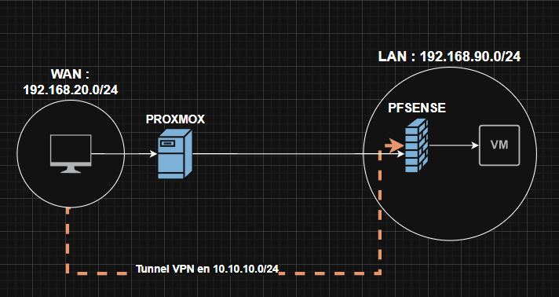
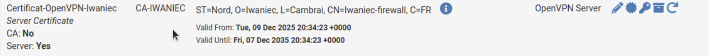
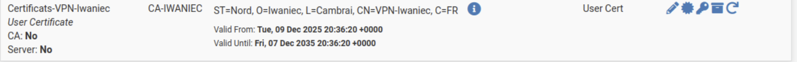
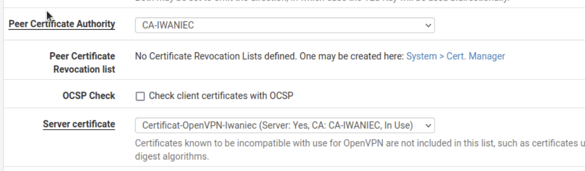
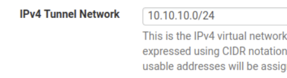
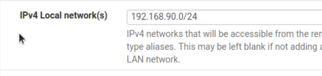
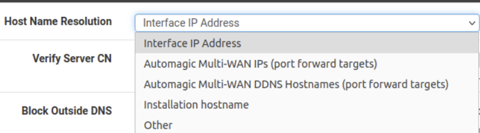
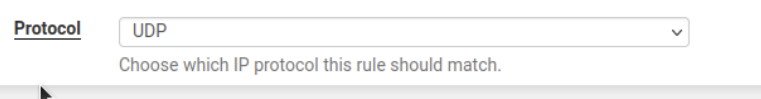
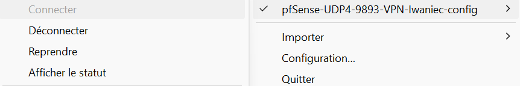

 TP-HAPROXY

  <table>
    <tr>
      <td style="vertical-align: middle;">
        Iwaniec 
        Hugo 
        BTS SIO
      </td>
      <td style="vertical-align: middle; text-align: right;">
        
      </td>
    </tr>
  </table>

---

**OpenVPN** sur pfSense est un service VPN SSL/TLS intégré qui permet de créer un tunnel chiffré entre des clients distants (PC, smartphones, sites distants) et le pare-feu. 

Grâce à ce tunnel, les utilisateurs peuvent accéder au réseau local derrière pfSense comme s’ils étaient sur place, ce qui est idéal pour le télétravail ou l’administration distante. 

OpenVPN fonctionne avec une autorité de certification et des certificats serveur/client.

> [!summary] Sommaire
> 1. Mise en place des serveurs WEB
> 2. Mise en place du serveur HAProxy
> 3. Phase de test

---
## Mise en place sur PFSENSE

> [!example] Introduction 
> Depuis un PFSENSE on se retrouve avec 2 interfaces : 
> - WAN : 192.168.20.227
> - LAN : 192.168.90.35
>   
>   
> Nous allons configurer un accès VPN nous permettant l'accès via un tunnel VPN à notre LAN depuis le WAN. 
> 
> 
> 

## Création des certificats :

On crée notre autorité de certification depuis System/Certificate/Authorities :

À l'aide de cette autorité on crée un certificat serveur :

Enfin on crée un utilisateur pour se connecter au VPN depuis System/User Manager / Users :

> [!important]
> Il faut penser à cocher la case certificate 
> 
> 
> 
> 
> 
> 
> Cela permet de créer un certificat pour l'utilisateur. 
> 

## Mise en place d’OpenVPN : 

Depuis VPN/OpenVPN/Servers, on ajoute un nouveau serveur : 

> [!todo] Configuration 
> Pour la configuration :
> 
> On met en place un chiffrement SSL/TLS et une authentification de l'utilisateur. 
> 
> 
> 
> Depuis l'interface WAN, on modifie le port par défaut. 
> 
> 
> 
> On ajoute notre autorité de certification et notre certificat **Serveur**.
> 
> 
> 
> On configure l'adresse de notre tunnel. 
> 
> 
> 
> L'option permet de forcer l'intégralité du trafic à passer par le VPN, si décochée les flux passent à la fois sur le VPN mais aussi sur le réseau du client.
> 
> 
> 
> On configure l'adresse de notre LAN, on peut ajouter plusieurs réseaux à l'aide d'une **,**
> IP1**,** IP2
> 
> 
> 
> En cochant cette case, on autorise le client à rester connecté même si son IP change pendant l'utilisation du VPN (utile si l'utilisateur se déplace).
> 
> 
> 
> Cette option crée des réseaux isolés par utilisateur, afin de limiter les échanges entre les utilisateurs connectés simultanément au VPN par la mise en place d'adresses en /30 par utilisateur.
> L'inconvénient est qu'elle divise donc par 4 les adresses disponibles sur notre tunnel.
> 
> 
> 
> 
> 
> 
> 

Depuis Package Manager on installe le paquet OpenVPN :

Depuis OpenVPN une nouvelle option a été ajoutée **Client Export***.

On se rend dessus et on le configure : 

On sélectionne la manière dont on se connecte au VPN, par l'adresse publique ou par le nom de domaine... 

Enfin en bas de la configuration, on retrouve nos accès VPN à télécharger, ils sont à transférer à nos clients.

## Règle du Firewall 

On crée une règle WAN afin d'autoriser la connexion depuis le VPN.

On sélectionne le protocole UDP.  

La source, on ne la connaît pas, par contre on ajoute notre destination, donc l'adresse de notre WAN ainsi que le port qu'on a préalablement configuré. 

## Test de connexion 

Depuis le site d’OpenVPN, on télécharge le client GUI et on l'installe : [https://openvpn.net/community/](https://openvpn.net/community/)  
On récupère nos accès.

On importe le fichier en .ovpn dans la configuration.

On peut maintenant se connecter au VPN avec succès.

On retrouve bien dans nos cartes réseau l'adresse de notre tunnel. 

Depuis l'onglet Rules/OpenVPN, on ajoute des règles afin de limiter les accès depuis le VPN.

Cela permet de choisir ce que l'on autorise comme accès depuis le VPN, étant en labo j'ai tout laissé disponible pour tester. 

> [!check] Vérification
> Je cherche donc à accéder à mon VPN depuis mon PC dans le WAN.
> 
> 
> 
> On accède bien au pfSense ainsi qu'à l'ensemble des services présents dans le LAN.
> 
> 
